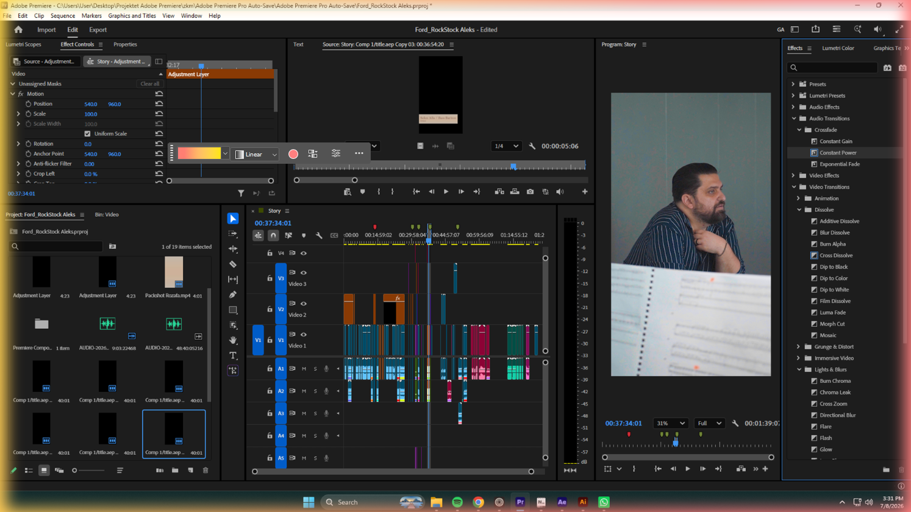
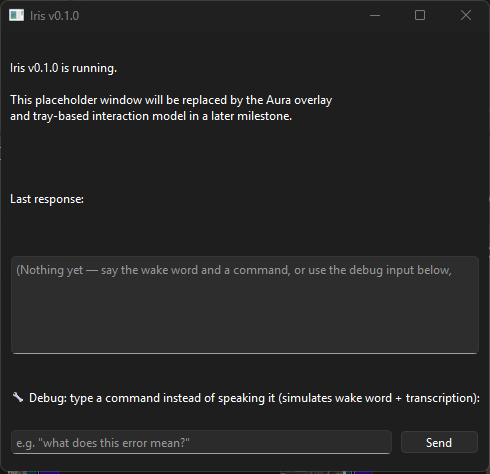
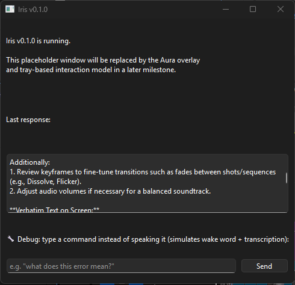

# Sentry

A voice-controlled AI assistant for your Windows desktop that runs entirely on
your own PC. You say the wake word, ask something about whatever's on your
screen, and it takes a screenshot, works out what it's looking at, and answers
out loud. It can even point at the thing you asked about. No cloud, no API
keys, no subscription.

<p align="center">
  
</p>

The colored glow around the screen edge is **Aura**. It changes color to show
what Sentry is doing: listening, thinking, speaking, or hit a problem.

> **A note on the name.** This project used to be called Iris. If you ran an
> older version, your data folder is moved from `%APPDATA%\Sentry` to
> `%APPDATA%\Sentry` on first launch, and the console command is now `sentry`
> (run `pip install -e .` again to get it). Your existing `config.yaml` comes
> along, and the old name in it (`app_name: Iris` and "You are Iris," in the
> system prompt) is updated on first launch. The rest of your settings are
> left as they were.

## Contents

- [What it does](#what-it-does)
- [Status](#status)
- [Design rules](#design-rules)
- [How a question gets answered](#how-a-question-gets-answered)
- [Aura](#aura)
- [The Dynamic Island](#the-dynamic-island)
- [Requirements](#requirements)
- [Install](#install)
- [Configuration](#configuration)
- [Using it](#using-it)
- [Screen awareness](#screen-awareness)
- [Where your data goes](#where-your-data-goes)
- [Project structure](#project-structure)
- [Performance](#performance)
- [Troubleshooting](#troubleshooting)
- [Development and tests](#development-and-tests)
- [Docs](#docs)
- [License](#license)

## What it does

You're stuck on something: an error message, a panel you don't recognize, a
setting you can't find. Instead of alt-tabbing to a browser and typing out a
description, you say the wake word and ask. Sentry looks at your screen, reads
it, and answers with the actual context in front of it.

- **Voice in.** Wake word detection plus local speech-to-text.
- **Screen awareness.** A vision model describes the scene, and OCR reads the
  exact text on screen.
- **Local LLM.** Answers come from a GGUF model running through llama.cpp.
- **Voice out.** Replies are spoken with a local text-to-speech voice, so
  answers are written to be heard: a few short sentences, no markdown.
- **Pointing.** Ask "where is the export button?" and Sentry flashes a
  rectangle around it on your screen.
- **Memory.** Conversations are saved to a local SQLite database, and recent
  turns are fed back in, so follow-ups like "what's my name?" work.
- **A pop-up island.** A small floating pill that expands when you press a
  hotkey or say the wake word.

Everything above runs on your machine.

## Status

Early, and built one milestone at a time. Here's the honest picture:

| Milestone | State |
| --- | --- |
| 1. Project scaffolding | Done |
| 2. Wake word detection | Done |
| 3. Speech to text | Done |
| 4. Local LLM | Done |
| 5. Screen capture + vision | Done |
| 6. Aura glow overlay | Done |
| 7. Visual guidance (the pointing box) | Code complete. Confirmed on real hardware once; the early-dismiss part hasn't been run on real hardware yet |
| 8. Voice responses (TTS) | Done, confirmed on real hardware |
| 9. Conversation memory | Done, confirmed on real hardware |
| 10. Dynamic Island | Widget, hotkey and wake-word activation work. Settings inside the island and retiring the old window are still open |
| 11. Realtime responsiveness | Latency timing is in. Streaming speech, barge-in that cancels generation, and audio-synced Aura are still open |

Still on the list: a custom wake word (it listens for "Hey Jarvis" for now) and
more real-hardware testing. Details are in [`docs/ROADMAP.md`](docs/ROADMAP.md),
[`docs/TODO.md`](docs/TODO.md) and [`HANDOFF.md`](HANDOFF.md), which is the
source of truth for the current state.

The window below is a placeholder from the early milestones. It's still shown
next to the island for now, and will be retired.

<p align="center">
  
  &nbsp;&nbsp;
  
</p>

<p align="center"><sub>Left: idle. Right: after asking about a Premiere Pro timeline.</sub></p>

## Design rules

These came first, and everything else follows from them.

1. **Everything runs locally.** No cloud inference, no paid APIs, no subscriptions.
2. **Offline-first.** After the models are downloaded, no internet is needed.
3. **Private by default.** No continuous screen or audio monitoring. Screenshots
   are analyzed and discarded unless you explicitly choose to keep one.
4. **Modular.** Voice, vision, LLM, speech output and Aura are separate pieces.
   Missing optional pieces are skipped instead of crashing the app.

The reasoning behind the bigger calls is in [`docs/DECISIONS.md`](docs/DECISIONS.md).

## How a question gets answered

```
wake word
   -> record until you stop talking
   -> transcribe
   -> (screenshot -> scene description + OCR)    only if vision is on and your question needs it
   -> (locate the thing you asked about)         only for "where / find / point" questions
   -> local LLM, with your last few turns
   -> save the turn
   -> speak the answer
```

Step by step:

1. **Wake word.** OpenWakeWord is the only thing listening. Aura goes green and
   the island expands.
2. **Recording.** Audio is buffered until you go quiet (simple silence detection).
3. **Transcription.** Faster-Whisper turns it into text. Aura goes purple.
4. **Screen context (optional).** If vision is on and your question contains a
   trigger word like "screen", "this" or "here", Sentry captures the screen and
   gets a scene description plus OCR text.
5. **Locating (optional).** If your question contains a word like "where" or
   "find", the vision model returns a box around the thing you asked about, and
   Sentry flashes it on screen.
6. **Answer.** The LLM gets your question, the screen context, and the last few
   saved turns of conversation.
7. **Speech.** Piper reads the answer aloud and Aura goes cyan, then back to blue.
   The island collapses.

| Job | Tool |
| --- | --- |
| Interface | PySide6 |
| Wake word | OpenWakeWord |
| Speech to text | Faster-Whisper |
| Screen capture | MSS, OpenCV, Pillow |
| Scene understanding and locating | MiniCPM-V-2.6 through llama.cpp |
| Exact on-screen text | Tesseract OCR |
| Answers | llama.cpp, any GGUF model |
| Text to speech | Piper |
| Memory | SQLite |
| Config | YAML validated with Pydantic |

## Aura

Aura is a soft glow along the edge of your screen: a click-through, always-on-top
overlay painted with Qt gradients. It cross-fades between colors when the state
changes (about a third of a second) and then holds still. No pulsing, no neon.

| State | Color | Meaning |
| --- | --- | --- |
| Idle | Blue | Waiting for the wake word |
| Listening | Green | Wake word heard, taking your question |
| Thinking | Purple | Transcribing, looking at the screen, generating |
| Speaking | Cyan | Reading the answer out loud |
| Error | Red | Something failed (see the logs) |
| Waiting for confirmation | Yellow | Defined, not used yet |

<p align="center">
  
</p>

If the glow can't start for any reason, Sentry falls back to a silent no-op
renderer and keeps running.

## The Dynamic Island

A small near-black pill floats at the bottom center of your screen. It expands
into a larger panel when:

- you press the global hotkey, **Ctrl+Shift+Space** by default, which works
  from any app, or
- the wake word fires (you can turn this off with `island.expand_on_wake_word`).

It collapses again when the turn ends. When `debug.enabled` is on, the expanded
island has a text box, so you can type a question instead of speaking it.

The hotkey is registered through the Windows API and is Windows-only. If another
app already owns the shortcut, Sentry logs a warning and carries on with the
wake word alone. Settings inside the island (Milestone 10, Part C) aren't built
yet; the gear icon is decoration for now.

## Requirements

**Hardware.** Built and tested mostly on:

- RTX 3070 Ti (8 GB VRAM)
- Ryzen 7 5700X
- 32 GB DDR4
- Windows 11

It has also been run on an older laptop with a Quadro M3000M (4 GB VRAM), where
it works but vision queries are very slow. Other setups are untested.

**Software.**

- Windows (the hotkey and some other bits are Windows-only)
- Python 3.12 or newer
- [Tesseract OCR](https://github.com/tesseract-ocr/tesseract), only for the vision feature
- Internet once, on first run, to download models

## Install

```bash
git clone https://github.com/alekslime/Sentry.git
cd Sentry
python -m venv .venv
.venv\Scripts\activate
pip install -e .
python main.py
```

That only gets you the window and the island. Add what you want:

| Extra | Adds | Main packages |
| --- | --- | --- |
| `speech` | Wake word and transcription | faster-whisper, openwakeword, sounddevice |
| `llm` | Local LLM answers | llama-cpp-python, huggingface_hub |
| `vision` | Screen awareness | mss, Pillow, opencv-python, llama-cpp-python, pytesseract |
| `tts` | Spoken answers | piper-tts, sounddevice |
| `windows` | Windows-only extras | pywin32 |
| `dev` | Tests and linting | pytest, black, ruff, mypy |

For the full experience:

```bash
pip install -e ".[speech,llm,vision,tts,windows]"
```

Anything you skip degrades gracefully:

- no `speech`: no wake word, but you can still type into the debug box
- no `llm`: the window says "no LLM configured" instead of answering
- no `vision`: Sentry never looks at your screen
- no `tts`: answers are shown but not spoken

Models are downloaded and cached the first time they're used.

## Configuration

On first launch, Sentry writes a config file you can edit:

```
%APPDATA%\Sentry\config\config.yaml
```

The defaults ship in [`config/default_config.yaml`](config/default_config.yaml),
which is heavily commented. The settings you're most likely to touch:

| Setting | Default | What it does |
| --- | --- | --- |
| `vision.enabled` | `false` | Master switch for screen capture. Off until you turn it on. |
| `vision.trigger_keywords` | `screen, see, look, this, here` | Vision only runs if your question contains one of these. `[]` means always. |
| `vision.locate_trigger_keywords` | `where, find, point, show me, locate` | Same idea for the pointing box. |
| `vision.max_image_dimension` | `512` | Downscale captures before the vision model sees them. Big speed win. |
| `vision.ocr_enabled` | `true` | Also read exact on-screen text with Tesseract. |
| `vision.tesseract_cmd` | `null` | Full path to Tesseract if it isn't on your `PATH`. |
| `llm.repo_id` / `llm.filename` | Qwen2.5-3B-Instruct, q4_k_m (~1.9 GB) | Which GGUF model to use. |
| `llm.local_model_path` | `null` | Point at a `.gguf` file to skip the download. |
| `llm.n_gpu_layers` | `-1` | `-1` offloads all layers to the GPU. |
| `tts.enabled` / `tts.voice` | `true` / `en_US-lessac-medium` | Spoken answers and which voice. |
| `tts.interrupt_on_new_query` | `true` | Stop talking when you ask the next question. |
| `memory.enabled` | `true` | Save conversations to SQLite. |
| `memory.context_turns` | `5` | How many past turns are fed back in. `0` turns follow-up memory off. |
| `island.hotkey` | `ctrl+shift+space` | Global shortcut for the island. |
| `island.expand_on_wake_word` | `true` | Also expand the island when the wake word fires. |
| `debug.enabled` | `true` | Show the typed-input boxes. |
| `voice.wake_word_model` | `hey_jarvis` | Placeholder wake word. |
| `speech.model_size` | `small` | Whisper model size. |

```yaml
# Let Sentry look at your screen when you ask
vision:
  enabled: true
```

**One gotcha.** If you already have a `config.yaml`, new settings are added
automatically, but changed *default values* are not. If a new version changes a
default (the vision keyword lists were one), your existing file keeps the old
value until you edit it or delete the file to regenerate it.

**Custom wake word.** Train one at
[openwakeword.com/train](https://openwakeword.com/train) and point
`voice.wake_word_model` at it. No code changes needed.

## Using it

1. Run `python main.py`.
2. Say the wake word, or press Ctrl+Shift+Space.
3. Ask your question.
4. Read or listen to the answer. It also shows in the window and the console.

If you'd rather type, use the debug box in the window or the island. It runs the
same pipeline a spoken question would.

A few things to try with vision on:

- "What does this error mean?"
- "What am I looking at on my screen?"
- "Where do I click to export this?" (flashes a box around the target)
- "Read me the text in this dialog."

Sentry handles one question at a time. If you ask a second one while the first
is still being generated, it's refused with a log warning rather than risking a
crash. Asking something new while it's still *speaking* is fine: speech stops
and the new question goes through.

## Screen awareness

Vision is the most sensitive feature, so it's opt-in twice over: you have to
install the `vision` extra *and* set `vision.enabled: true`. Until then Sentry
never captures the screen.

When it's on and your question triggers it:

1. MSS takes a screenshot, which is downscaled (long side 512 px by default).
2. **MiniCPM-V-2.6** describes the screen. The prompt is tuned for an assistant
   rather than a human reader: it skips narrating window chrome and notes what
   a domain expert would flag (exposure and pacing in a video editor, bugs in
   code, formula problems in a spreadsheet).
3. **Tesseract** reads the exact text, keeping words above a confidence
   threshold. A vision model alone tends to paraphrase small text, so OCR keeps
   error codes, filenames and button labels accurate. If the two disagree, the
   assistant is told to trust the OCR text.
4. Both go into the prompt along with your question.
5. The screenshot is discarded.

For pointing questions, the vision model returns a box (as percentages of the
screen), Sentry converts it to pixels, clamps it to the screen, and flashes an
outline around it. The box clears when you ask your next question or when your
cursor stays inside it for about four seconds, and otherwise times out by itself.

## Where your data goes

Nothing leaves your machine: no telemetry, no account, no cloud calls. The only
network use is downloading models the first time.

On Windows, everything lives under `%APPDATA%\Sentry\`:

| Folder | Contents |
| --- | --- |
| `config\` | Your `config.yaml` |
| `logs\` | Rotating log files |
| `data\` | `conversations.db` (your chat history), and debug screenshots only if you turn that on |
| `models\` | Downloaded Piper voices and other cached models |

There's no always-on screen or audio recording. The only thing listening in the
background is the wake word detector. To wipe your history, delete
`conversations.db` or set `memory.enabled: false`.

## Project structure

```
Sentry/
├── main.py                 entry point; wires everything together
├── app/                    UI shell and thread bridges
│   ├── main_window.py      placeholder window (to be retired)
│   ├── dynamic_island.py   the floating pill
│   ├── hotkey.py           global hotkey through the Win32 API
│   └── *_bridge.py         move results from worker threads to the Qt thread
├── aura/                   the glow overlay
│   ├── controller.py       what the rest of the app talks to
│   ├── states.py           states and their colors
│   └── renderer/           glow renderer, no-op fallback, interface
├── voice/                  microphone stream and wake word detection
├── speech/                 silence detection and Faster-Whisper transcription
├── llm/                    llama.cpp engine, with conversation history
├── vision/                 screen capture, MiniCPM-V, Tesseract OCR
├── tts/                    Piper text to speech
├── memory/                 SQLite conversation store
├── config/                 schema, settings loading, paths, default_config.yaml
├── utils/                  logging and per-turn latency timing
├── overlay/                placeholder, empty for now
├── automation/             placeholder for future mouse/keyboard automation
├── tests/                  pytest suite
├── docs/                   architecture, decisions, roadmap, TODO
├── test_vision.py          standalone vision check
├── HANDOFF.md              current state of the project
└── LICENSE
```

`aura/animations`, `aura/shaders` and `aura/themes` exist but are empty,
reserved for later work. [`docs/ARCHITECTURE.md`](docs/ARCHITECTURE.md) explains
how the pieces connect and why they're split this way.

## Performance

Every turn logs a one-line timing summary at INFO level, like
`stt=340ms llm=890ms tts=210ms total=1.44s`, so you can see where time goes.

Things worth knowing:

- **Vision is the slow part.** On the 3070 Ti, a screen-aware query took about
  234 seconds at full resolution because the image-encoding step runs on the CPU
  regardless of GPU settings (a known llama-cpp-python limitation).
  Downscaling captures to 512 px brought that down to roughly 22 seconds, and
  that's now the default. Questions that don't trigger vision are much faster.
- **GPU offload for the LLM.** `pip install llama-cpp-python` gets you a
  CPU-only build by default. If the LLM feels slow, check you have a
  CUDA-enabled build.
- **Speech starts after the whole answer is written.** Streaming the first
  sentence while the rest generates is on the roadmap.

## Troubleshooting

| Problem | What to check |
| --- | --- |
| Wake word never triggers | Install the `speech` extra, check your Windows default mic, and try the debug text box to see if the rest works. |
| Window says "no LLM configured" | Install the `llm` extra and check the `llm:` section of your config. |
| Vision does nothing | `vision.enabled: true`, `vision` extra installed, and your question contains a trigger word like "this" or "screen". |
| OCR errors or empty text | Install Tesseract and put it on your `PATH`, or set `vision.tesseract_cmd`. |
| Answers aren't spoken | Install the `tts` extra, check `tts.enabled`, and look at the logs for voice-loading errors. |
| Ctrl+Shift+Space does nothing | Another app probably owns that shortcut. Check the logs, then change `island.hotkey`. |
| The target box vanished before I saw it | Vision queries can take a while. The box stays up for 8 seconds, which is a provisional value. |
| Follow-up questions don't remember anything | `memory.enabled` and `memory.context_turns` (0 turns memory off). |
| New defaults not taking effect | Your existing `config.yaml` keeps old values. Edit it or delete it to regenerate. |
| Crash while sending two queries quickly | Fixed with a guard that refuses the second query. Not yet re-tested on real hardware, so please report it if you still see it. |

Logs live in `%APPDATA%\Sentry\logs\`.

## Development and tests

```bash
pip install -e ".[speech,llm,vision,tts,windows,dev]"
python -m pytest tests/ -q
```

There are 92 tests covering settings, the LLM engine's message assembly, vision
and OCR, TTS, memory, timing, transcription and hotkey parsing. They fake the
heavy models, so they run without GPUs or weights. The Qt-related parts have
mostly been verified with an offscreen Qt platform (`QT_QPA_PLATFORM=offscreen`)
plus real-hardware runs rather than committed UI tests.

The project is built in small, confirmed parts, and every session ends with an
updated `HANDOFF.md`. Before changing something, read
[`docs/DECISIONS.md`](docs/DECISIONS.md) so you know why it works the way it
does, and keep to the four design rules above.

## Docs

| File | What's in it |
| --- | --- |
| [`HANDOFF.md`](HANDOFF.md) | Current state of the project (source of truth) |
| [`docs/ARCHITECTURE.md`](docs/ARCHITECTURE.md) | Folder structure and how modules connect |
| [`docs/DECISIONS.md`](docs/DECISIONS.md) | Why things are built the way they are |
| [`docs/ROADMAP.md`](docs/ROADMAP.md) | What's done and what's next |
| [`docs/TODO.md`](docs/TODO.md) | Open items and verification gaps |

Some of the older docs, especially `docs/ARCHITECTURE.md`, still describe the
early ONNX vision model and haven't caught up with the later milestones.

## License

All rights reserved. The source is public to read, but no license is granted to
use, copy, modify or distribute it without the author's written permission. See
[`LICENSE`](LICENSE).
